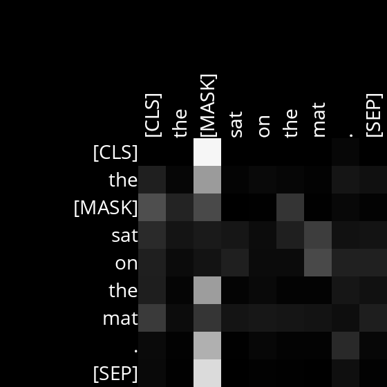
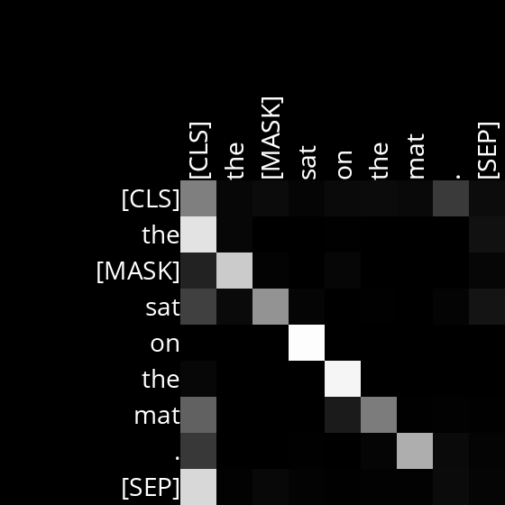
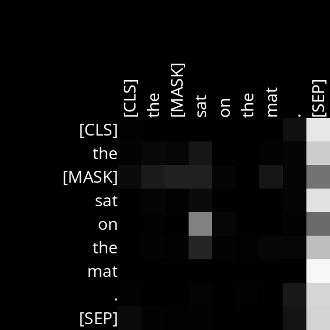

# Masked Language Model with BERT

This project explores the use of a Masked Language Model (MLM) built on BERT (Bidirectional Encoder Representations from Transformers) to predict masked words in text sequences and visualize attention patterns in BERT's multi-headed attention mechanism.

## Overview

Masked Language Modeling is a pre-training task for language models like BERT, where the model predicts masked words based on the surrounding context. This project involves:
1. **Using Hugging Face's transformers library** to predict masked words with BERT.
2. **Visualizing attention scores** from BERT's 144 attention heads to gain insights into its language understanding.

## Key Features

- **Masked Word Prediction**: Replace a word in a sentence with `[MASK]`, and the model predicts possible replacements.
- **Attention Visualization**: Generate attention diagrams for each of BERT's attention heads to explore relationships between tokens.
- **Analysis of Attention Heads**: Investigate the roles of specific attention heads in understanding natural language.

## Requirements

- Python 3.7 or higher
- Install dependencies using the provided `requirements.txt` file:
  ```bash
  pip3 install -r requirements.txt
## Generating Attention Diagrams
The script also visualizes attention patterns across tokens in the input text. Each diagram represents attention weights for specific layers and heads of the BERT model. For instance:

**Input:**  
`"The [MASK] sat on the mat."`

**Output:**  
Attention diagrams are generated and saved as image files:  
- 
- 
-   

These diagrams show the relationships between tokens based on attention weights.

---


## How It Works

1. **Input and Tokenization**:
   - The user provides a sentence containing a `[MASK]` token (e.g., "The turtle moved slowly across the [MASK].").
   - The `AutoTokenizer` processes the input, converting it into token IDs, including special tokens like `[CLS]` (start), `[SEP]` (end), and `[MASK]`.

2. **BERT Model**:
   - The tokenized input is passed to `TFBertForMaskedLM`, a pre-trained BERT model designed for masked language modeling.
   - BERT uses **self-attention mechanisms** to determine the context of the `[MASK]` token by analyzing its relationships with other tokens in the sequence.

3. **Attention Mechanism**:
   - Self-attention allows BERT to compute attention scores for every token pair, showing how much focus one token places on another.
   - Each attention layer contains multiple **attention heads**, with each head specializing in different patterns (e.g., word order, grammar relationships).

4. **Visualization**:
   - The program visualizes attention weights as grids, where lighter colors indicate stronger attention.
   - These diagrams offer insights into how BERT processes language, such as identifying relationships between words (e.g., adverbs modifying verbs).


## Example Sentences:
1. Input: `"The [MASK] car drove down the empty street."`  
   - **Prediction:** `"red"`, `"blue"`, `"fast"`.  
   - The head attends to "car" and associates it with likely adjectives.  

2. Input: `"She bought a [MASK] dress."`  
   - **Prediction:** `"beautiful"`, `"red"`, `"new"`.  
   - The head attends to "dress" and connects it with descriptive adjectives.

3. Input: `"The turtle moved slowly across the [MASK]."`
   - Prediction: `[MASK]` → "field", "water", "road", etc.  
   - Visualization: Attention heads show how "slowly" attends to "moved" and other relationships in the sentence.

---


